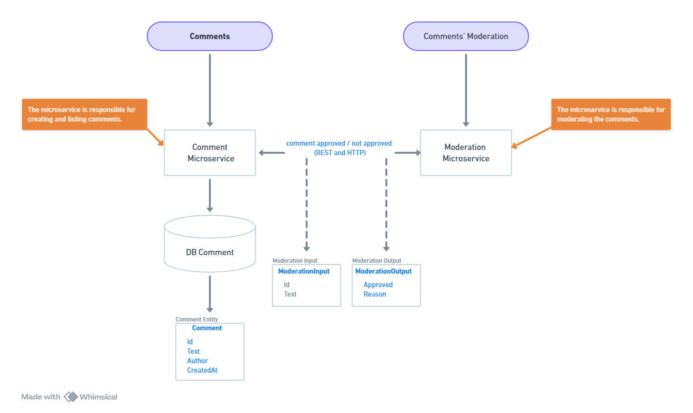

# ems-algacomments-meta

This project is an exercise from the AlgaWorks microservices course.

The task is to develop a system composed of two microservices that communicate synchronously via HTTP/REST using Spring RestClient.
The system will be responsible for receiving user comments, validating them against forbidden words, and storing only the approved ones.

## Project Diagram

## Microservice: Comment

### Endpoints

There are three endpoints:

- **POST** `/api/comments`  
  Creates a new comment.

- **GET** `/api/comments/{id}`  
  Retrieves a comment by its ID.

- **GET** `/api/comments`  
  Retrieves all comments with pagination.

